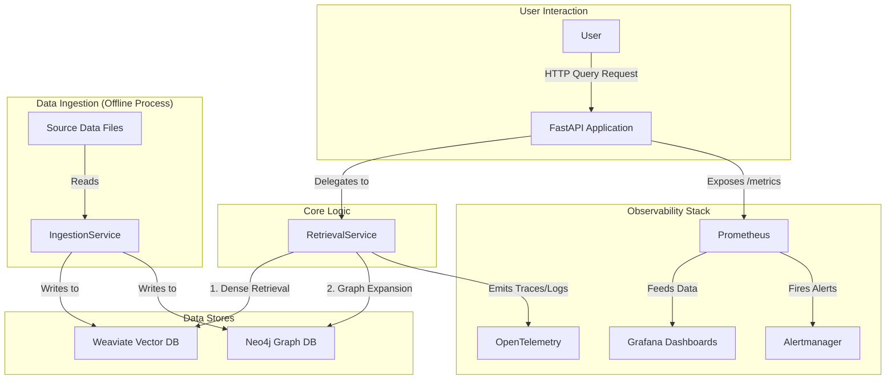

# Architecture - Graph Weave

This document provides a comprehensive overview of the system architecture for the Graph Weave project. It outlines the guiding principles, core components, data flows, and infrastructure that enable a scalable and production-ready Hybrid RAG system.

## 1. Guiding Principles

The architecture is designed around a core set of principles to ensure robustness, maintainability, and flexibility. These are documented in detail in [ADR-002: Adoption of Design Patterns](./docs/adr/ADR-002-adoption-of-design-patterns.md).

* **Protocol-Oriented Design (Ports & Adapters)**: Core functionalities, especially external dependencies like databases, are defined by abstract interfaces (`Protocols`). This decouples the application's business logic from concrete technology implementations, allowing for easy substitution (e.g., swapping Weaviate for another vector database) without impacting the core services.
* **Managed Service Lifecycle**: Every stateful component (e.g., database connections) is treated as a managed service with a defined lifecycle (`start`, `stop`, `is_ready`). This ensures graceful startup and shutdown, preventing resource leaks and improving reliability.
* **Centralized Composition Root**: The application's dependencies are instantiated and wired together in a single, well-defined place (the FastAPI `lifespan` manager). This makes the system's dependency graph explicit and easier to manage.
* **Observability by Default**: The system is instrumented from the ground up with structured logging, distributed tracing (OpenTelemetry), and metrics (Prometheus), making it transparent and easy to monitor in a production environment.

## 2. High-Level Diagram

The following diagram illustrates the primary components and their interactions within the Graph Weave ecosystem.

## 3. Core Components

The application is logically divided into several key components, each with a distinct responsibility.

#### `src/graph/api`
This is the main entrypoint for the application. It exposes the RESTful API using **FastAPI**. Its primary responsibilities include:
* Defining the API contract (request/response models).
* Handling incoming HTTP requests and routing them to the appropriate services.
* Managing the application's lifecycle via the `lifespan` event handler, which acts as the **Composition Root**.

#### `src/graph/retrieval`
This component contains the "brain" of the RAG system. The `RetrievalService` orchestrates the hybrid retrieval process:
1.  Receives a user query.
2.  Performs semantic search against the vector store (`VectorStoreProtocol`).
3.  Extracts entities from the results.
4.  Enriches the context by traversing the graph store (`GraphStoreProtocol`).
5.  Fuses and re-ranks the results before returning them.

#### `src/graph/ingestion`
This component is responsible for the offline data processing pipeline. The `IngestionService` reads data from source files, processes it in memory-efficient batches, generates embeddings, and populates both the vector and graph databases.

#### `src/graph/infra`
This is the foundational layer of the application, providing reusable, cross-cutting concerns. It embodies the "Fortify" pattern mentioned in the ADRs.
* **`store/`**: Defines the `Protocols` for data storage (`GraphStoreProtocol`, `VectorStoreProtocol`) and contains the concrete provider implementations (e.g., `Neo4jStoreProvider`, `WeaviateStore`).
* **`services/`**: Provides the `BaseService` class for lifecycle management.
* **`observability/`**: Contains all logic for tracing, metrics, logging, and health checks. The `@with_observability` decorator provides a simple way to instrument any function.
* **`config/`**: Manages environment-aware configuration loading (`Dynaconf`) and validation (`Pydantic`).
* **`context/`**: Manages request-scoped context (e.g., `request_id`, `trace_id`) using Python's `contextvars` for safe propagation across async tasks.

## 4. Data Flows

### Ingestion Flow
The ingestion process is designed to be idempotent and batch-oriented.

1.  The `IngestionService` is triggered (e.g., via the `executor.py` script).
2.  It reads documents, entities, and edges from `.jsonl` files in batches.
3.  For each batch of documents, it generates embeddings using a `SentenceTransformer` model.
4.  The documents and their vectors are upserted into **Weaviate**.
5.  Document and entity nodes are upserted into **Neo4j**.
6.  `MENTIONS` relationships are created in Neo4j to link documents and entities.

### Query Flow
The query flow is optimized for low latency and high-quality responses.

1.  A `POST /query` request is received by the **FastAPI** app.
2.  The `RetrievalService` performs a vector search in **Weaviate** to get the top-k documents.
3.  Entities from these documents are used to query **Neo4j** for related entities (graph expansion).
4.  The initial set of documents is re-ranked, boosting scores for documents that contain entities found in the expanded graph context.
5.  The top results are compiled into a final context string and returned to the user with citations.

## 5. Infrastructure

* **Containerization**: The entire application and its dependencies (Neo4j, Weaviate) are containerized using **Docker Compose**. The infrastructure is modular, defined in the `infra/` directory, making it easy to manage and deploy.
* **Monitoring**: The `monitoring/` directory contains a self-contained observability stack (Prometheus, Grafana, Alertmanager), allowing for immediate, production-grade monitoring of the running application.

## 6. Architectural Decision Records (ADRs)

Key architectural choices are formally documented to provide context and rationale.
* **[ADR-001](./docs/adr/ADR-001-adoption-of-hybrid-rag-architecture.md)**: Justifies the choice of a hybrid vector and graph approach over simpler alternatives.
* **[ADR-002](./docs/adr/ADR-002-adoption-of-design-patterns.md)**: Details the adoption of the core software engineering patterns that define this architecture.
* **[ADR-003](./docs/adr/ADR-003-selection-of-vector-and-graph-databases.md)**: Explains the selection of Weaviate and Neo4j as the initial database technologies.

>© Guandaline 2025